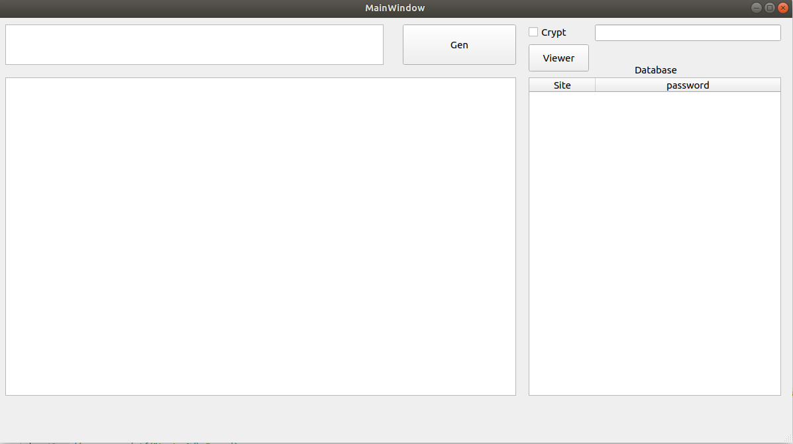
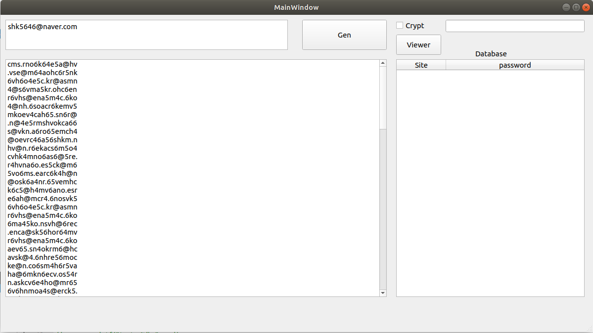
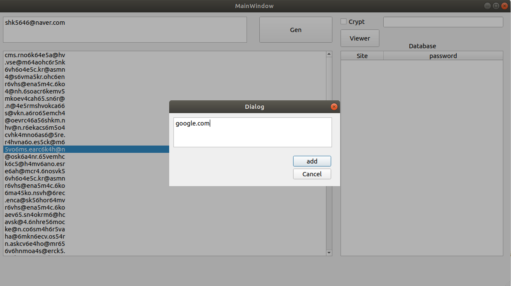
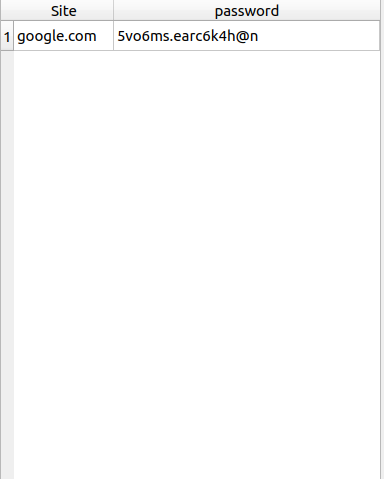
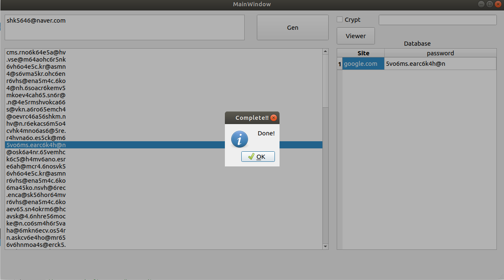
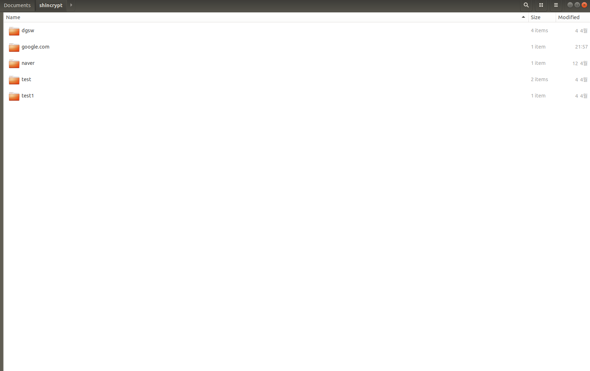
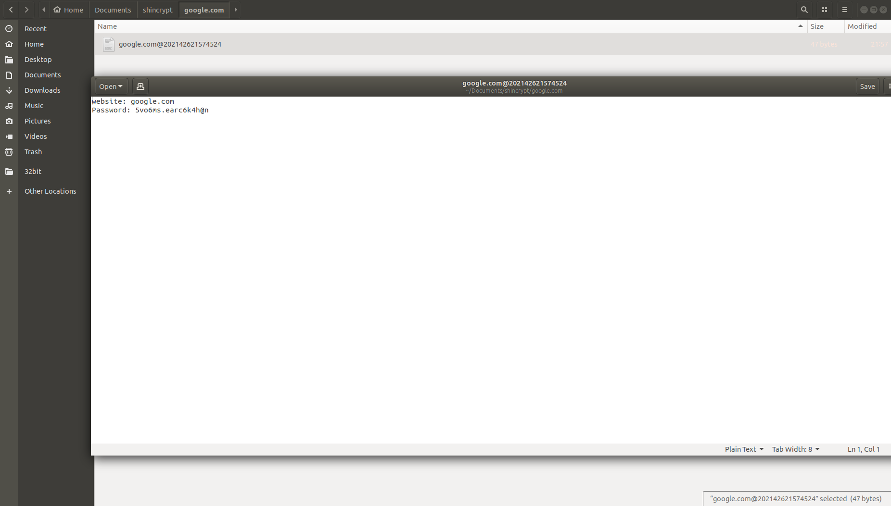

# Shin-Password-Generator
## 개발자
* Lösung(LionKingSmasher)
## 사용 가능한 환경
* Ubuntu 18.04 ~
## 제작 목적
* 규칙이 있는 패스워드로 인한 보안 취약에 대비하기위하여 만든 것으로 무작위로 배열한 패스워드를 파일로 내보내어, 사용자가 까먹지 않게 함과 동시에 보안 강화를 목적으로 제작함
## 사용 프로그래밍 언어 및 프레임워크
* 언어
	- C/C++
* 프레임워크
	- Qt5(GUI)
## 사용 방법
\
\

### 1. 실행을 한 이후 Gen 버튼 옆에 있는 입력칸에 원하는 문자열을 입력한다.
\
\

### 2. Gen 버튼을 누를 경우, 무작위로 배열된 패스워드 100개가 나온다.
\
\

### 3. 원하는 입력을 박스에 입력한 이후 add 버튼을 누른다
\
\

### 4. 시트에 입력한 내용들이 나온다.
\
\

### 5. 시트에 있는 패스워드 혹은 사이트를 클릭할 경우 파일을 내보냄과 동시에 성공/실패 메시지를 띄운다.(성공할 경우 6번으로 향한다)
\
\

### 6. 홈 디렉터리 기준 문서 폴더에 자신이 입력한 사이트의 이름으로 생성된 폴더에 들어간다.
\
\

### 7. 내부에 있는 파일에 자신이 저장한 패스워드를 볼 수 있다.

## 사용 가능 기능
* 패스워드 생성
* 만든 패스워드 파일로 내보내기

## 추가 혹은 구현 중인 예정 기능
* 암호화 기능(파일 암호화)

## 버그 및 기타 문의
* shk052353@gmail.com : Lösung의 이메일
